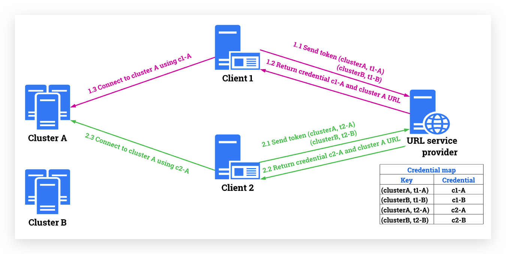
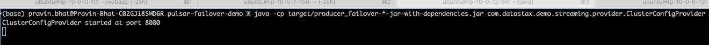
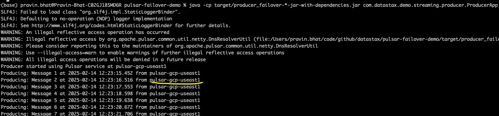
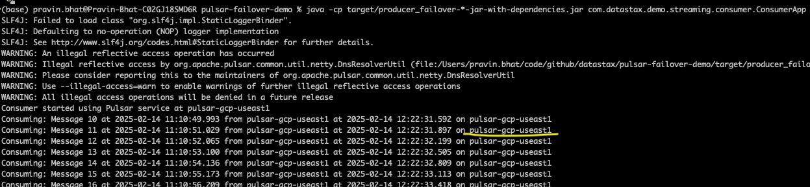
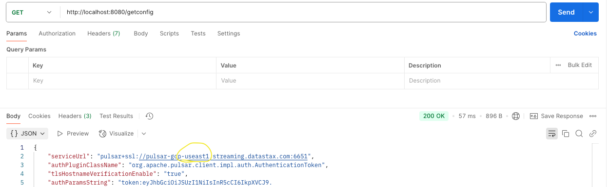
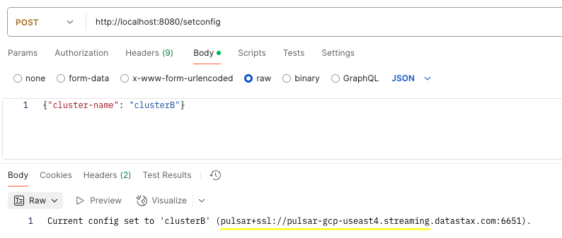
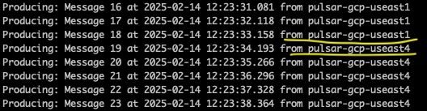
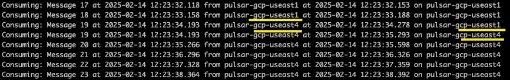

# pulsar-failover-demo
A sample app that demos [Pulsar](https://pulsar.apache.org/ "Pulsar") client-side [Controlled failover](https://pulsar.apache.org/docs/3.3.x/client-libraries-cluster-level-failover/#controlled-failover "Controlled failover") 

This app has three components
- A [**Provider** app](https://github.com/datastax/pulsar-failover-demo/blob/main/src/main/java/com/datastax/demo/streaming/provider/ClusterConfigProvider.java "**Provider** app") that works as a simple URL Service Provider as [shown here](https://pulsar.apache.org/docs/3.3.x/client-libraries-cluster-level-failover/#controlled-failover "shown here"). You must start one (only one) instance of this app before you start anything else (i.e. Producer or Consumer). If you plan on having more than one instance of this app for High-Availability (HA), you must put these instances behind a single HA load-balancer and the Producer and Consumer will need to access it via the load-balancer.
- A [**Producer** app](https://github.com/datastax/pulsar-failover-demo/blob/main/src/main/java/com/datastax/demo/streaming/producer/ProducerApp.java "**Producer** app") that produce messages at regular intervals. You can start one of more instances of this app.
- A [**Consumer** app](https://github.com/datastax/pulsar-failover-demo/blob/main/src/main/java/com/datastax/demo/streaming/consumer/ConsumerApp.java "**Consumer** app") that consumes messages produced by the above Producer. You can start one of more instances of this app.

Below is a high-level diagram of the above components and the Pulsar Controlled Failover flow

------------

### Prerequisites
- Java 11
- Apache Maven 3.8.x (to build the app)
- Pulsar 3.x 
- Two (or more) Pulsar based Streaming clusters
  - One clusters will be the **Primary**, while all the other clusters will be **DR** clusters that can takeover in case of a failover
  - For the purpose of this demo, we will use [Astra Streaming](https://www.datastax.com/products/astra-streaming) (SaaS Streaming provider by DataStax) to standup two Pulsar based streaming clusters.
 
 
### Building the app
From root of this repo, run command `mvn clean package -Passembly`

### Running the app
First start the **Provider** app using command `java -cp target/producer_failover-*-jar-with-dependencies.jar com.datastax.demo.streaming.provider.ClusterConfigProvider` 

Then start the **Producer** app using command `java -cp target/producer_failover-*-jar-with-dependencies.jar com.datastax.demo.streaming.producer.ProducerApp` 

Finally start the **Consumer** app using command `java -cp target/producer_failover-*-jar-with-dependencies.jar com.datastax.demo.streaming.consumer.ConsumerApp` 

> [!NOTE]
> You can have as many (one or more) instances of `Producers` and `Consumer`, however you must have only one instance of `Provider`. 

### Performing failover
The above demo app uses two [Astra Streaming](https://www.datastax.com/products/astra-streaming) SaaS clusters (ideally deployed in different regions) with bidirectional replication. [Internally](https://github.com/datastax/pulsar-failover-demo/blob/main/src/main/resources/application.properties#L2) it refers to them as **clusterA** and **clusterB**. Initially, clusterA is the default **Primary** and clusterB is **DR/Failover**. 

You can find which cluster is currently Primary at anytime by hitting the Provider endpoint at `/getConfig`. If you are running the app locally, it can be accessed [here](http://localhost:8080/getconfig) `http://localhost:8080/getconfig`

To inject a failover, go to Provider endpoint `/setConfig` and pass a JSON request body of `{"cluster-name": "clusterB"}`. Note, the value can be `clusterA` OR `clusterB` based on the cluster you want to failover to.  If running locally, you could initiate a failover by posting the above JSON body to [endpoint](http://localhost:8080/setconfig) `http://localhost:8080/setconfig`

------------

### Demo 
- Start `Provider`, followed by `Producer` and `Consumer`. Producer and Consumer messages show `clusterA` (useast1) as the primary (see below screenshots)

  
  
  
  
  

- On `Provider`, check the current Cluster via a tool like Postname (see below screenshots)

  

- On `Provider`, now perform failover to `clusterB`

  

- Now `Producer` and `Consumer` messages should show `clusterB` (useast4) post failover

  
  
  
